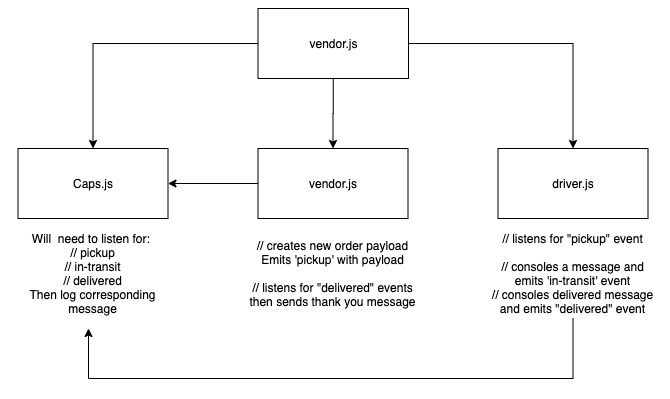

# Project: Code Academy Parcel Service (CAPS)

## LAB - Class 16

### Author: Davee Sok

### Links and Resources

- [ci/cd](https://github.com/davee-401-advanced-javascript/caps-system/actions) (GitHub Actions)
- [Lab 16 Pull Request](https://github.com/davee-401-advanced-javascript/caps-system/pull/1)
- [Lab 18 Pull Request](https://github.com/davee-401-advanced-javascript/caps-system/pull/2)
- [back-end server url](https://caps-lab.herokuapp.com/)
<!-- - [front-end application](http://xyz.com) (when applicable) -->

### Setup

#### `.env` requirements (where applicable)

Add the following to an .env file and make up a store name:

```
MYSTORE= enter a store name here
```

#### How to initialize/run your application (where applicable)

Enter the following into your terminal:

```
node caps.js
```

#### How to use your library (where applicable)

#### Tests

<!-- - How do you run tests?
- Any tests of note?
- Describe any tests that you did not complete, skipped, etc -->

No test written yet

#### UML


